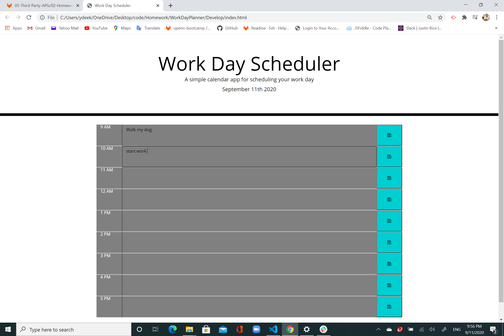

# Work Day Planner

This the fifth homework assignment for Penn LSP Coding Bootcamp. This simpler calendar application makes user able to mark their event for each hour of a workday. This project required using Javascript and jQuery featured with Moment.js. 

Check out this simple calendar application in the following link : 

 https://ydeek91.github.io/WorkDayPlanner/

